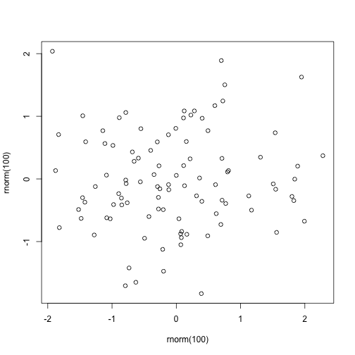
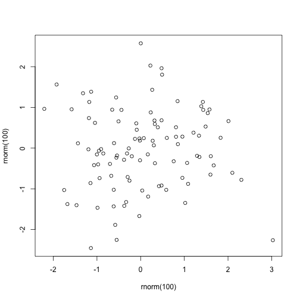

## The Application

The Shiny app I prepared compares the real mean with the sample mean.
It draws samples from normal distribution which parameters can be adjusted.

--- .class #id 

## Variance Influence

When you increase the variance the difference usually increases.

--- .class #id 

## Sample Size Influence

When you increase the sample size the discrepancy between the means decreases.

--- .class #id 

## Thank you!

* Thank you for checking my project!
* Hope you enjoy it!
* Please, be forgiving.

--- .class #id 

